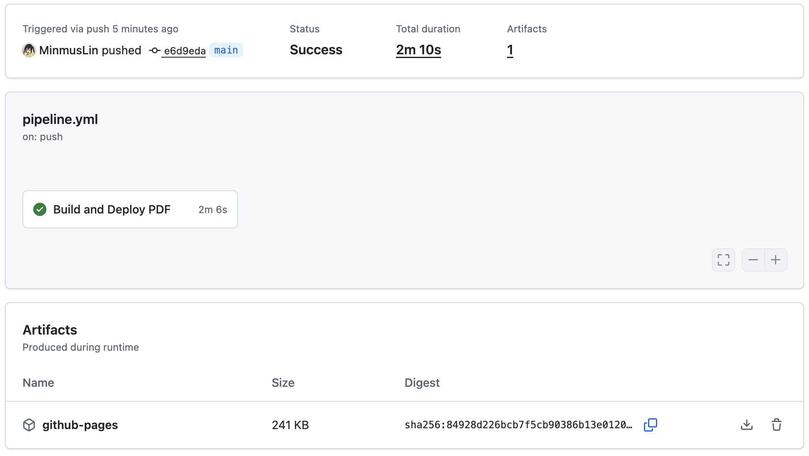

# Resume Template

## 仓库名称

Resume_Template

## 仓库简介

Resume template.

简历模板。

## 仓库组成

* `/style`
样式文件

* `main.pdf`
示例 PDF 文档文件

* `main.tex`
主文档文件

* `make.bat`
编译脚本文件

## 编译项目

### 流水线触发编译

每次向 main 分支执行推送操作后，将自动触发 GitHub Actions 工作流执行 LaTeX 编译任务。工作流执行完成后，可在该次运行的 ​​Artifacts​​ 区域下载 LaTeX 编译生成的 PDF 文件。



LaTeX 编译生成的 PDF 文件将自动推送至 Git 仓库的 main 分支，并自动发布至 GitHub Pages，可通过以下固定 URL 访问：

```
​​https://{user_name}.github.io/{repository_name}/cv.pdf​
```

### 本地触发编译

```
Usage: make [options]

Options:
  - all      Use xelatex to compile the LaTeX document.
  - clean    Clean temporary files.
  - help     Show this help message.

Note: make without any option is equivalent to make all.
```

## 致谢

Special thanks to [fky2015](https://github.com/fky2015) for developing the [Resume-NG](https://github.com/fky2015/resume-ng) LaTeX template. This project builds upon these excellent works, and we extend our gratitude to all developers in the open-source community for their support and contributions.

特别感谢 [fky2015](https://github.com/fky2015) 开发的 [Resume-NG](https://github.com/fky2015/resume-ng) LaTeX 模板。本项目在这些优秀作品的基础上进行了改进，感谢开源社区所有开发者的支持与贡献。

## 文档更新日期

2025年9月16日
